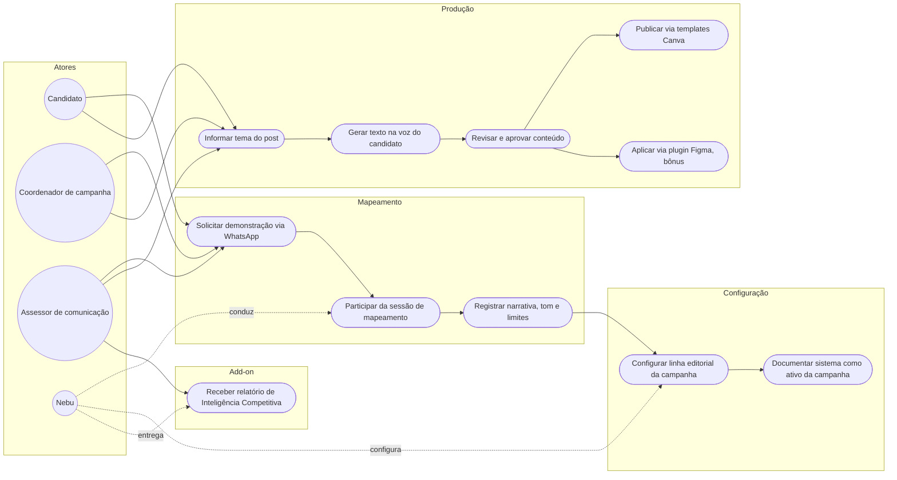
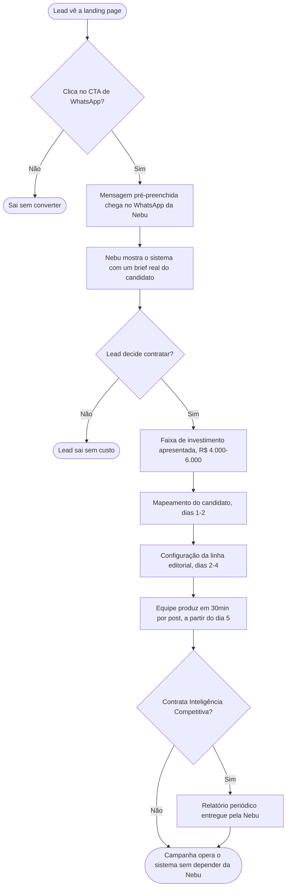

# PRD — Escale.ai

Referência de estratégia completa: [DNA.md](DNA.md). Este documento cobre requisitos de produto, funil de conversão e casos de uso. Não repete posicionamento e personas em detalhe, só o necessário pra contexto.

---

## 1. Visão geral

Escale.ai é um sistema de produção de conteúdo por IA para campanhas políticas. O produto entregue ao mercado tem duas camadas:

1. **A landing page (`index.html`) e o funil de contratação**, que qualifica e converte lead em demonstração agendada via WhatsApp.
2. **O sistema em si**, estruturado em mapeamento do candidato, configuração de linha editorial e produção diária dentro da voz do candidato.

Este PRD trata as duas camadas como um produto único: a landing page só funciona se o funil reflete com precisão o que o sistema realmente entrega.

---

## 2. Problema a resolver

Campanhas sem estrutura de assessoria grande — um candidato, um coordenador, uma equipe de duas a cinco pessoas — precisam sustentar 3 posts por dia na voz certa, todo dia, competindo pela mesma atenção que deveria ir para estratégia e agenda. O padrão de voz normalmente mora na memória de uma pessoa (o próprio candidato, um coordenador, um redator). Quando essa pessoa não está disponível — de madrugada, no meio de uma crise, ou porque saiu da campanha — a produção trava ou perde consistência. Ferramentas genéricas de IA (ChatGPT sem contexto) não resolvem porque cada prompt começa do zero.

---

## 3. Público e personas

Detalhamento completo em `DNA.md`, seção 4. Resumo operacional:

| Persona | Papel na campanha | Motivo da contratação (resumo) |
|---|---|---|
| Marina (pré-candidata a vereadora) | Decisora única, produz sozinha | Reagir a notícia em minutos sem parar a agenda para escrever |
| Diego (coordenador de campanha, prefeito) | Decisor, gerencia equipe pequena | Nova frente de conteúdo sem precisar contratar mais gente |
| Camila (assessora de comunicação, deputado) | Decisora, campanha de reeleição | Padrão de voz que sobrevive a troca de equipe; considera add-on de inteligência competitiva |

Fora de escopo nesta fase: agências que gerenciam carteira de múltiplos candidatos como clientes recorrentes (anti-persona 1 do DNA — era o público original, pivotado nesta sessão).

---

## 4. Escopo do produto

### Dentro do escopo
- Landing page de captação (`index.html`), com seções: hero, dor, comparativo antes/depois, como funciona, add-on de inteligência competitiva, resultado, licença, FAQ, chamada final.
- Funil de contratação via WhatsApp (sem formulário próprio nesta fase).
- Mapeamento do candidato (dias 1-2): sessão com a Nebu para registrar narrativa, posicionamento, temas, tom de voz, o que nunca diria.
- Configuração da linha editorial da campanha (dias 2-4): formatos, critérios de relevância, linhas de pauta.
- Produção assistida por IA dentro da voz do candidato, entregue via templates prontos no Canva.
- Plugin de Figma como bônus, para quem já tem workflow de design nessa ferramenta.
- Add-on opcional Inteligência Competitiva™ (monitoramento de adversários, tendências, relatório periódico).
- Guia de operação escrito, entregue com o sistema, para uso sem dependência contínua da Nebu.

### Fora de escopo (nesta fase)
- Decisão de posicionamento político ou construção de narrativa do zero — o sistema produz dentro do que já foi definido no mapeamento, não define estratégia política.
- Publicação sem revisão humana. Todo conteúdo gerado passa por aprovação de alguém da campanha antes de ir ao ar.
- Disparo em massa ou automação de mensageria (WhatsApp, SMS, e-mail). O produto é de produção de conteúdo para publicação em perfis próprios, não de distribuição automatizada.
- Gestão de crise ou media training — o sistema acelera a produção de posicionamento de rotina; crise séria ainda exige julgamento humano fora do produto.
- Venda para agência como modelo de revenda em escala (fora do público primário desta fase — ver `DNA.md`, seção 4.1).
- Preço explícito na landing page — fica para negociação direta via WhatsApp.
- Internacionalização. Produto e comunicação são pt-BR, desenhado para o marco eleitoral brasileiro.

---

## 5. Requisitos funcionais por etapa

### 5.1 Mapeamento do candidato
- RF01: a sessão de mapeamento deve registrar, no mínimo, narrativa, posicionamento, temas prioritários, tom de voz e limites explícitos ("o que nunca diria").
- RF02: o resultado do mapeamento deve ficar documentado como ativo da campanha, acessível a qualquer pessoa autorizada da equipe, não preso à pessoa que participou da sessão.

### 5.2 Configuração da linha editorial
- RF03: o sistema editorial deve incluir formatos, critérios de relevância e linhas de pauta específicos da campanha, não um template genérico fixo.
- RF04: qualquer pessoa nova que entre na equipe deve conseguir operar no padrão documentado sem treinamento presencial da Nebu.

### 5.3 Produção
- RF05: o tempo de produção por post (do tema informado ao texto pronto para publicação) deve ficar em torno de 30 minutos.
- RF06: todo texto gerado deve sair estruturado nos templates do Canva por padrão, sem exigir edição manual de layout.
- RF07: o plugin de Figma deve entregar o texto gerado diretamente no arquivo, para quem optar pelo bônus.
- RF08: nenhum conteúdo pode ser publicado automaticamente sem passo explícito de revisão e aprovação humana no fluxo.

### 5.4 Add-on Inteligência Competitiva™
- RF09: o relatório periódico deve cobrir, no mínimo, monitoramento de adversários diretos, tendências do eleitorado e recomendações de ajuste de estratégia de conteúdo.

---

## 6. Requisitos da landing page

- RNF01: tempo de carregamento percebido abaixo de 2 segundos em conexão 4G (página estática, sem backend).
- RNF02: responsiva de 375px a 1440px de largura, testada em mobile antes de qualquer divulgação paga.
- RNF03: todo CTA leva para WhatsApp com mensagem pré-preenchida.
- RNF04: nenhuma menção a preço explícito na página — a faixa de investimento (R$ 4.000–6.000, ver `DNA.md`, seção 6) fica reservada para a conversa via WhatsApp.
- RNF05: linguagem falando diretamente com quem está dentro da campanha (candidato, coordenador, estrategista) — sem enquadrar a dor como problema de margem, contratação ou orçamento de agência (ver histórico do pivô, `DNA.md` seção 4.1).
- RNF06: nenhuma alegação de resultado eleitoral. Números de eficiência (posts/mês, horas economizadas) podem aparecer como estimativa de rotina, nunca como promessa de resultado de campanha.

---

## 7. Casos de uso

---

## 8. Fluxo do lead (funil completo)

---

## 8.1. Casos de uso e demonstração de eficiência

Números abaixo refletem a matemática já publicada na landing page (seção "A conta não mente"), consistente com RNF06: são estimativa de rotina típica, não medição validada por campanha real.

### Caso de uso: produção diária de conteúdo, com e sem sistema

**Situação:** manter 3 posts por dia, 5 dias por semana, exige 60 posts por mês. Sem sistema, cada post consome cerca de 4 horas entre resgatar contexto, escrever e revisar — 240 horas de produção por mês, equivalente a uma pessoa dedicada em tempo integral só para isso.

**Como o Escale.ai age:** o contexto do candidato já está no sistema. Cada post passa a consumir cerca de 30 minutos — 30 horas de produção por mês.

**Conta:**
- Sem sistema: 60 posts × 4h = 240h/mês
- Com Escale.ai: 60 posts × 30min = 30h/mês
- **Horas devolvidas: ~210h/mês**, para quem lidera a comunicação focar em estratégia, agenda e resposta a crise.

---

## 9. Métricas de sucesso

- Taxa de conversão de visita na landing page para clique no WhatsApp.
- Taxa de conversão de demonstração para contratação da licença.
- Tempo médio entre primeiro contato e sistema operando (meta: 5 dias, RNF do funil).
- Tempo médio de produção por post após onboarding (meta: 30 minutos).
- Taxa de adoção do add-on Inteligência Competitiva entre clientes ativos.
- Retenção de padrão de voz percebida pela campanha após troca de pessoa na equipe (medir em pesquisa pós-entrega, não em suposição).

---

## 10. Riscos

- **Compliance eleitoral com uso de IA.** O marco regulatório do TSE para uso de inteligência artificial em campanhas (rotulagem de conteúdo sintético, vedação a deepfake) precisa ser validado com assessoria jurídica eleitoral antes de qualquer publicação em escala — o produto não deve ser comunicado nem operado de forma que sugira geração de conteúdo sem supervisão humana ou sem transparência sobre uso de IA.
- **Publicação sem revisão humana.** Mitigado por RF08, mas depende da disciplina operacional do cliente — vale reforçar no guia de operação e no onboarding.
- **Confundir o Escale.ai com ferramenta de disparo em massa.** Fora de escopo declarado (seção 4), mas o mercado de campanha associa "IA + WhatsApp" a spam — a comunicação precisa deixar isso explícito.
- **Persistência do posicionamento antigo em materiais paralelos.** Outras versões da landing page (`index 3.html`, `index .html`) ainda carregam a linguagem de agência do posicionamento anterior — precisam ser revisadas, alinhadas ou descartadas para não circular mensagem inconsistente.
- **Preço fora da faixa validada.** R$ 4.000–6.000 é decisão desta sessão, ainda sem teste de mercado direto com o novo público (candidato/coordenador, não agência) — vale validar com as primeiras vendas antes de tratar como faixa definitiva.

---

## 11. Fases

**Fase 1 (atual):** landing page repositionada para candidato/coordenador/estrategista, preço fora da página, Canva como entregável padrão. Validar taxa de conversão do funil com o novo público.

**Fase 2:** validar a faixa de preço R$ 4.000–6.000 com vendas reais; ajustar se necessário. Confirmar compliance eleitoral do fluxo de produção com assessoria jurídica.

**Fase 3:** decidir o destino das versões antigas da landing page (`index 3.html`, `index .html`) e consolidar em uma única fonte de verdade.

---

## Relacionados
- [DNA.md](DNA.md): estratégia, posicionamento, personas completas, escopo negativo, histórico do pivô
